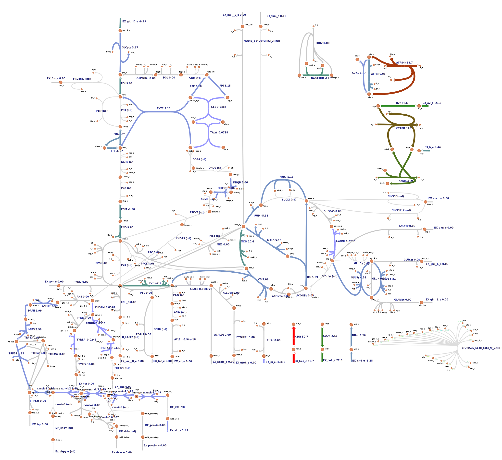

# 2021-igem-ugm-model

## **C. violaceum Genome Scale Metabolic Model Update**
Thanks to the [original author](https://journals.plos.org/plosone/article?id=10.1371/journal.pone.0210008) for sharing the map! Nevertheless, curation are still needed as the reaction and metabolite ids does not match between the escher map and the model. I've tried to make a [speedy script (messy as hell)](notebook/01_model_curation.ipynb) to help the curation. And here are the results:
* [SBML Model](results/iDB858_curated_phase1.xml)
* [Curated Map (Phase-1)](results/edited_map_reaction_curated_phase1.json)



We still need to match some metabolites and reaction, which requires manual curation.  
Therefore, what we need to do is:
* Find matching metabolite in the model: [tables/metabolite_map.csv](tables/metabolite_map.csv)
* Find which of these reaction are the matches: [tables/double_reactions.csv](tables/double_reactions.csv)
* Find out the remaining mismatch reactions from the map: [tables/missing_on_map.csv](tables/missing_on_map.csv), with the model: [all_reactions_in_model.csv](tables/all_reactions_in_model.csv)

## Conda installation
I am using WSL2 with Conda to run this tutorial, some pointers to set it up in my blog: https://matinnuhamunada.github.io/posts/2021/04/jupyter-wsl2/

## Clone the repository
* Clone (or perhaps its better to fork?) the repository to your PC. In my case, I start by running the ubuntu terminal and type:
```
git clone git@github.com:iGEM-UGM/2021-igem-ugm-model.git
# move to the cloned repo
cd 2021-igem-ugm-model
```

## Environment installation
* Install the Conda environment required using the yml file:
```
conda env create -f envs/ugm.yml
```

* Activate the environment:
```
conda activate 2021-ugm-modelling-env
```

* Run Jupyter Lab
```
jupyter lab
# Open Jupyter in a browser by copy-paste the url given
```

* Video tutorial here: https://drive.google.com/file/d/1XYOH8r_zDZsPCQwluGJOaOGtDzJPJSM6/view?usp=sharing

## Test if all dependencies are correctly installed
* Run the notebook

* There might be trouble installing Escher Jupyter widget. You can solve it by following the escher docs:
```
# The notebook extenstion should install automatically. You can check by running:
jupyter nbextension list
# Make sure you have version >=5 of the `notebook` package
pip install "notebook>=5"
# To manually install the extension
jupyter nbextension install --py --sys-prefix escher
jupyter nbextension enable --py --sys-prefix escher
# depending on you environment, you might need the `--sysprefix` flag with those commands
jupyter labextension install @jupyter-widgets/jupyterlab-manager
jupyter labextension install escher
```

* Video tutorial here: https://drive.google.com/file/d/1HONYDWtZhTv2Kvi2mhQ6P5gshvXd936A/view?usp=sharing
