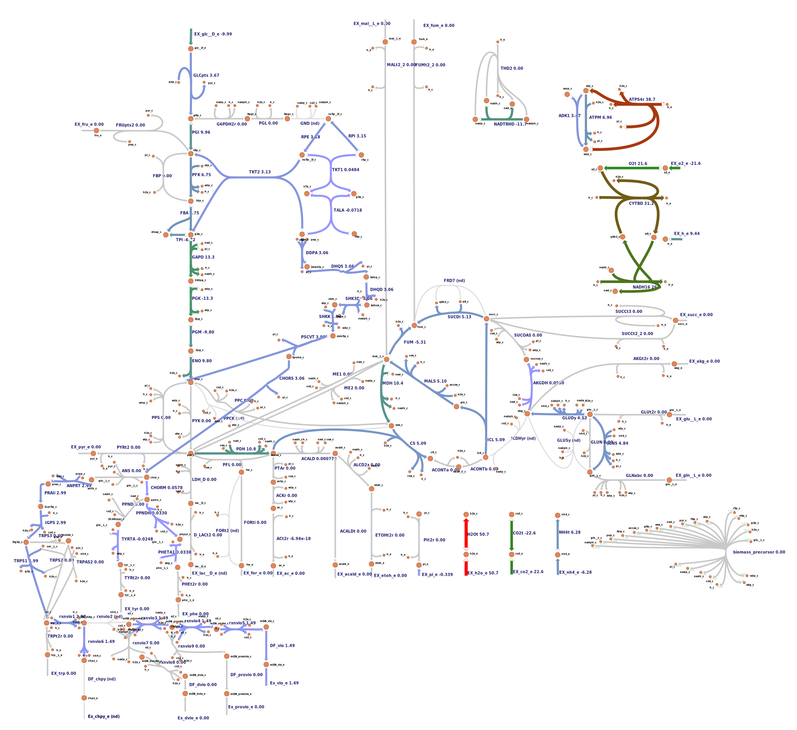

# 2021-igem-ugm-model

## **KO Strategy update**
I rewrite the tutorial from cameo: https://cameo.bio/05-predict-gene-knockout-strategies.html as there are some parts that are not yet updated with escher API.  
You can find [**the notebook here**](notebooks/03_find_knockout.ipynb).  
You can also find the [**mutants map here**](figures/).

## **C. violaceum Genome Scale Metabolic Model Update**
Thanks to the [original author](https://journals.plos.org/plosone/article?id=10.1371/journal.pone.0210008) for sharing the map! Nevertheless, curation are still needed as the reaction and metabolite ids does not match between the escher map and the model. 

The 1st phase curation is done using this [script (messy as hell)](notebooks/01_model_curation.ipynb), and the 2nd phase curation was done with the [curated reaction tables](tables/reaction_map.csv) and this [script](notebooks/02_model_curation_phase2.ipynb). And here are the results:
* [SBML Model](results/iDB858_curated_phase2.xml)
* [Curated Map (Phase-2)](results/edited_map_reaction_curated_phase2.json)



## Conda installation
I am using WSL2 with Conda to run this tutorial, some pointers to set it up in my blog: https://matinnuhamunada.github.io/posts/2021/04/jupyter-wsl2/

## Clone the repository
* Clone (or perhaps its better to fork?) the repository to your PC. In my case, I start by running the ubuntu terminal and type:
```
git clone git@github.com:iGEM-UGM/2021-igem-ugm-model.git
# move to the cloned repo
cd 2021-igem-ugm-model
```

## Environment installation
* Install the Conda environment required using the yml file:
```
conda env create -f envs/ugm.yml
```

* Activate the environment:
```
conda activate 2021-ugm-modelling-env
```

* Run Jupyter Lab
```
jupyter lab
# Open Jupyter in a browser by copy-paste the url given
```

* Video tutorial here: https://drive.google.com/file/d/1XYOH8r_zDZsPCQwluGJOaOGtDzJPJSM6/view?usp=sharing

## Test if all dependencies are correctly installed
* Run the notebook

* There might be trouble installing Escher Jupyter widget. You can solve it by following the escher docs:
```
# The notebook extenstion should install automatically. You can check by running:
jupyter nbextension list
# Make sure you have version >=5 of the `notebook` package
pip install "notebook>=5"
# To manually install the extension
jupyter nbextension install --py --sys-prefix escher
jupyter nbextension enable --py --sys-prefix escher
# depending on you environment, you might need the `--sysprefix` flag with those commands
jupyter labextension install @jupyter-widgets/jupyterlab-manager
jupyter labextension install escher
```

* Video tutorial here: https://drive.google.com/file/d/1HONYDWtZhTv2Kvi2mhQ6P5gshvXd936A/view?usp=sharing
